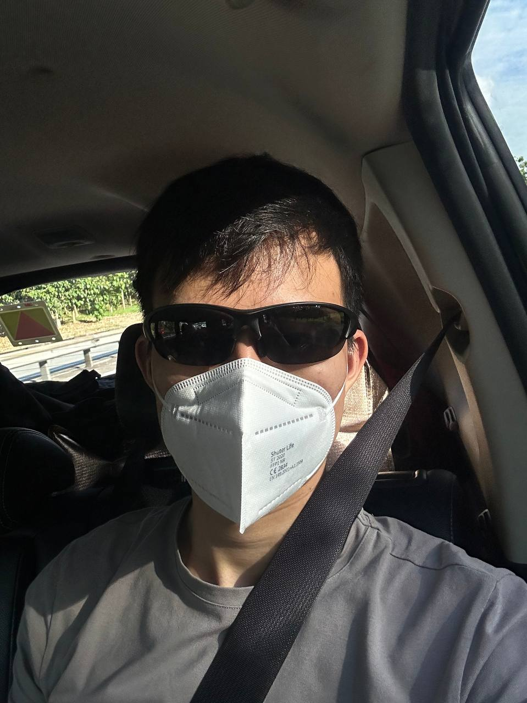

# Greetings from the Lion City , Adrian here!

    

## About Me 👋

- I'm a `student` studying `Computer Science` in a local university in `🇸🇬`.
- Also a part-time student at [**42 Singapore**](https://www.42singapore.sg/) @ SUTD.
- Graduated with a diploma in `Biomedical Science` in `2021`.
- Prior experience with laboratory work, working with `bacteria`.
- I like `swimming` and `reading` about history and biology.

## Repertoire

  

## Get In Touch

    
    </a>
    
    </a>
    
    </a>

## Statistics

    

    

